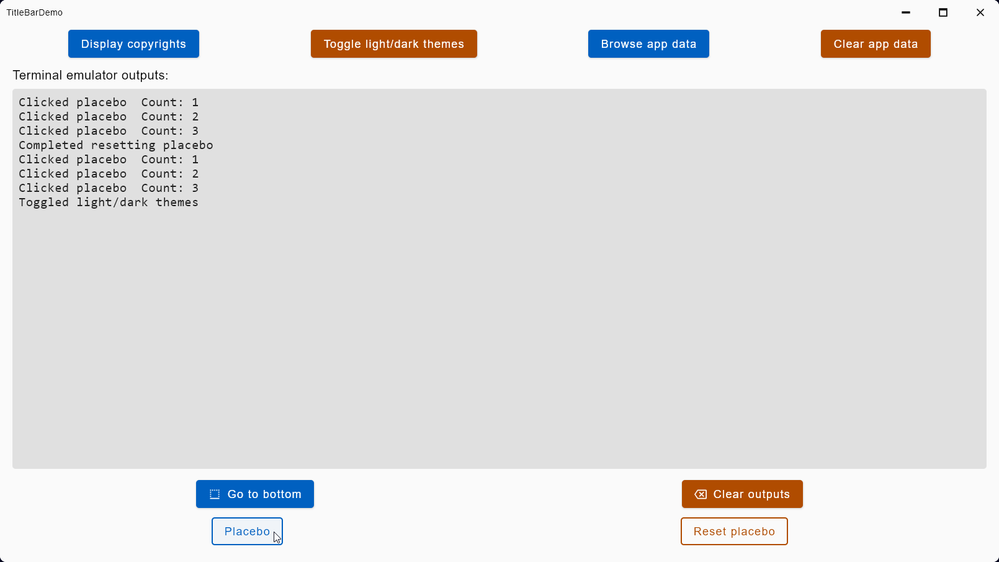

<!---
Copyright 2022 Yucheng Liu. Apache License Version 2.0.
Apache License Version 2.0 copy: http://www.apache.org/licenses/LICENSE-2.0
--->

# LYC-KotlinUtils

Personal Kotlin utility collection library.

# Usage

`java -jar lyc-ktutils-<version>.jar <command> ...`

# Help Page

```powershell
> java -jar .\ktutils-<version>.jar help
LYC-KotlinUtils <version>
Help: java -jar ktutils-<version>.jar help
- mainArgs
  [0]: help
- End mainArgs
- LYC-KotlinUtils help info
Usage:  java -jar ktutils-<version>.jar <command> ...
-- Commands
Help:           java -jar ktutils-<version>.jar help
TermOutsDemo:   java -jar ktutils-<version>.jar term-outs-demo
TitleBarsDemo:  java -jar ktutils-<version>.jar title-bars-demo
-- End Commands
- End LYC-KotlinUtils help info
```

# Demo Screenshots

Terminal outputs demo, custom light theme.


Terminal outputs demo, custom dark theme.


Title bars demo, custom light theme.


Title bars demo, custom dark theme.


# Open-source Licenses

This application uses some open-source libraries. Their licenses are listed in
the [`README-Assets/Open-Source-Licenses.txt`](README-Assets/Open-Source-Licenses.txt) file of this repository.

# Miscellaneous

## Versions

### Versioning

```text
The versioning of this library is based on Semantic Versioning.
You can see the complete Semantic Versioning specification from
  https://semver.org/.
Basically, the version name of this library is in the form of:
  x.y.z
  Where x, y, and z are integers that are greater than or equal to 0.
  Where x, y, and z are separated by dots.
  x stands for the major version and indicates non-compatible major changes to
    the library.
  y stands for the minor version and indicates forward compatible minor
    changes to the library.
  z stands for the patch version and indicates bug fixes and patches to the
    library.
```

### Version Tags

```text
The version tags of this repository has the form of a letter "v" followed by a
  semantic version.
Given a semantic version:
  $x.$y.$z
  Where $x, $y, and $z are the semantic major, minor, and patch versions.
The corresponding version tag would be:
  v$x.$y.$z
The version tags are on the main branch.
```

## Copyright

### Short Version

```text
Copyright (C) 2022 Yucheng Liu. Apache License Version 2.0.

You should have and keep a copy of the above license. If not, please get it
  from http://www.apache.org/licenses/LICENSE-2.0.
```

### Long Version

```text
LYC-KotlinUtils, LYC's personal Kotlin utility collection library.
Copyright (C) 2022 Yucheng Liu. Apache License Version 2.0.

Licensed under the Apache License, Version 2.0 (the "License");
  you may not use this file except in compliance with the License.
You may obtain a copy of the License at:
  http://www.apache.org/licenses/LICENSE-2.0

Unless required by applicable law or agreed to in writing, software
  distributed under the License is distributed on an "AS IS" BASIS, WITHOUT
  WARRANTIES OR CONDITIONS OF ANY KIND, either express or implied.
See the License for the specific language governing permissions and
  limitations under the License.
```
