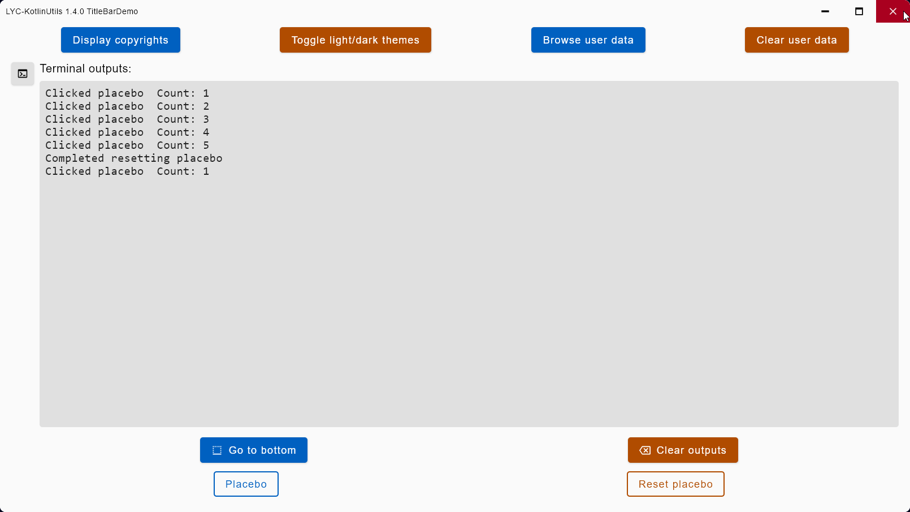
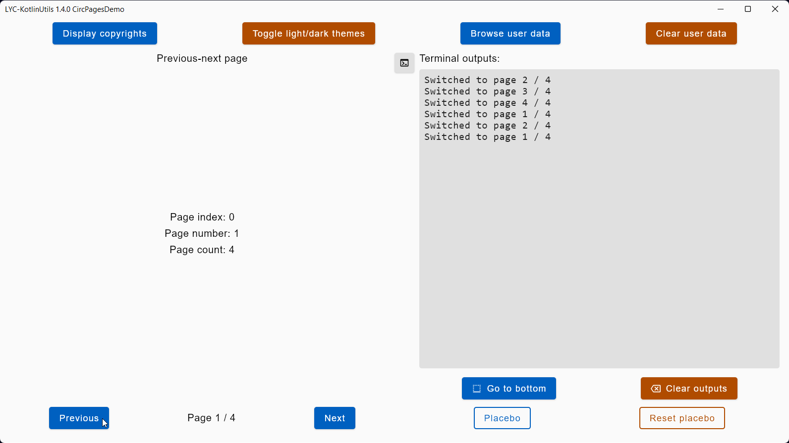
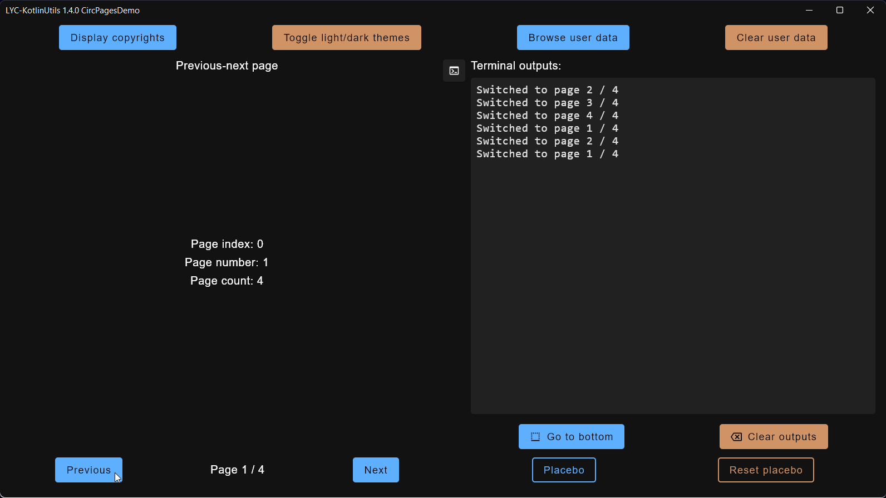
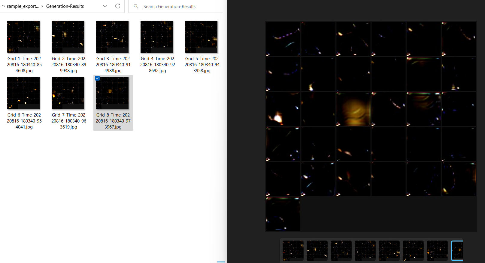

<!---
Copyright 2022 Yucheng Liu. Apache License Version 2.0.
Apache License Version 2.0 copy: http://www.apache.org/licenses/LICENSE-2.0
--->

# LYC-KotlinUtils

Personal Kotlin utility collection library.

# Usage

`java -jar ktutils-<version>.jar <command> ...`

# Help Page

```powershell
> java -jar .\ktutils-<version>.jar help
LYC-KotlinUtils 1.5.0
Help: java -jar ktutils-1.5.0.jar help
- mainArgs
  [0]: help
- End mainArgs
- LYC-KotlinUtils help info
Usage:  java -jar ktutils-1.5.0.jar <command> ...
-- Commands
Help:               java -jar ktutils-1.5.0.jar help
TermOutsDemo:       java -jar ktutils-1.5.0.jar term-outs-demo
TitleBarsDemo:      java -jar ktutils-1.5.0.jar title-bars-demo
CircPagesDemo:      java -jar ktutils-1.5.0.jar circ-pages-demo
ConfigFieldsDemo:   java -jar ktutils-1.5.0.jar config-fields-demo
ConfigViewsDemo:    java -jar ktutils-1.5.0.jar config-views-demo
-- End Commands
- End LYC-KotlinUtils help info
```

# Demo Screenshots and Outputs
## Custom Light Theme Screenshots

Terminal outputs demo.


Title bars demo.


Circular pages demo.


Config fields demo.


Config views demo.


## Custom Dark Theme Screenshots

Terminal outputs demo.


Title bars demo.


Circular pages demo.


Config fields demo.


Config views demo.


# Command-line Outputs And Screenshots

DJLGenProcsDemo command-line outputs.

```powershell
> java -jar .\ktutils-<version>.jar djl-gen-procs-demo
Help: java -jar ktutils-1.6.0.jar help
LYC-KotlinUtils 1.6.0
- mainArgs
  [0]: djl-gen-procs-demo
- End mainArgs
DJLGenProcsDemo generation process
Generation process completed: false
Started preparation
App data path: C:\Users\<User>\.lyc_ktutils\app_data
Exportation path: C:\Users\<User>\.lyc_ktutils\sample_exportation
Ensured Generation-Results folder in exportation path
Loaded djl_gen_procs_demo.json from app data
Loaded generator_config.json from exportation path
Started parsing generation configuration
Parsed auto seed enabled: true
Parsed manual seed: 0
Parsed GPU count: 1
Parsed image count: 256
Parsed images per batch: 32
Parsed image quality: 95
Parsed grid mode - enabled: true
Parsed grid mode - images per grid: 64
Parsed grid mode - padding: 2
Completed parsing generation configuration
Started parsing generator configuration
Parsed input noise resolution: 2
Parsed input noise channel count: 32
Parsed output image resolution: 64
Parsed output image channel count: 3
Completed parsing generator configuration
Started setting-up random
Seed (Auto): 662141585
Done setting Kotlin random number generator
SLF4J: Class path contains multiple SLF4J bindings.
SLF4J: Found binding in [jar:file:/<...>/LYC-KotlinUtils/ktutils/build/libs/ktutils-1.6.0.jar!/org/slf4j/impl/StaticLoggerBinder.class]
SLF4J: Found binding in [jar:file:/C:/Users/<User>/.gradle/caches/modules-2/files-2.1/org.slf4j/slf4j-simple/1.7.36/a41f9cfe6faafb2eb83a1c7dd2d0dfd844e2a936/slf4j-simple-1.7.36.jar!/org/slf4j/impl/StaticLoggerBinder.class]
SLF4J: See http://www.slf4j.org/codes.html#multiple_bindings for an explanation.
SLF4J: Actual binding is of type [org.slf4j.impl.SimpleLoggerFactory]
[main] WARN ai.djl.pytorch.jni.LibUtils - No matching cuda flavor for win-x86_64 found: cu65.
[main] INFO ai.djl.pytorch.engine.PtEngine - Number of inter-op threads is 8
[main] INFO ai.djl.pytorch.engine.PtEngine - Number of intra-op threads is 8
Done setting DJL random number generator
Completed setting-up random
Started setting-up hardware
Done setting DJL default device: cpu()
Completed setting-up hardware
Done setting-up input/output dimension sizes
Started setting-up input noise batches
Done setting-up noise batch: 1 / 8
Done setting-up noise batch: 8 / 8
Completed setting-up input noise batches
Completed preparation
Started generation
Started generating images
Loaded model
Done generating image batch 1 / 8
Done generating image batch 8 / 8
Completed generating images
Done converting batches to images
Done converting images to grids
Done saving grids
Completed generation
Generation process completed: true
End DJLGenProcsDemo generation process
```

DJLGenProcsDemo results screenshot.



# Open-source Licenses

This application uses some open-source libraries. Their licenses are listed in
the [`README-Assets/Open-Source-Licenses.txt`](README-Assets/Open-Source-Licenses.txt) file of this repository.

# Miscellaneous

## Versions

### Versioning

```text
The versioning of this library is based on Semantic Versioning.
You can see the complete Semantic Versioning specification from
  https://semver.org/.
Basically, the version name of this library is in the form of:
  x.y.z
  Where x, y, and z are integers that are greater than or equal to 0.
  Where x, y, and z are separated by dots.
  x stands for the major version and indicates non-compatible major changes to
    the library.
  y stands for the minor version and indicates forward compatible minor
    changes to the library.
  z stands for the patch version and indicates bug fixes and patches to the
    library.
```

### Version Tags

```text
The version tags of this repository has the form of a letter "v" followed by a
  semantic version.
Given a semantic version:
  $x.$y.$z
  Where $x, $y, and $z are the semantic major, minor, and patch versions.
The corresponding version tag would be:
  v$x.$y.$z
The version tags are on the main branch.
```

## Copyright

### Short Version

```text
Copyright (C) 2022 Yucheng Liu. Apache License Version 2.0.

You should have and keep a copy of the above license. If not, please get it
  from http://www.apache.org/licenses/LICENSE-2.0.
```

### Long Version

```text
LYC-KotlinUtils, LYC's personal Kotlin utility collection library.
Copyright (C) 2022 Yucheng Liu. Apache License Version 2.0.

Licensed under the Apache License, Version 2.0 (the "License");
  you may not use this file except in compliance with the License.
You may obtain a copy of the License at:
  http://www.apache.org/licenses/LICENSE-2.0

Unless required by applicable law or agreed to in writing, software
  distributed under the License is distributed on an "AS IS" BASIS, WITHOUT
  WARRANTIES OR CONDITIONS OF ANY KIND, either express or implied.
See the License for the specific language governing permissions and
  limitations under the License.
```
